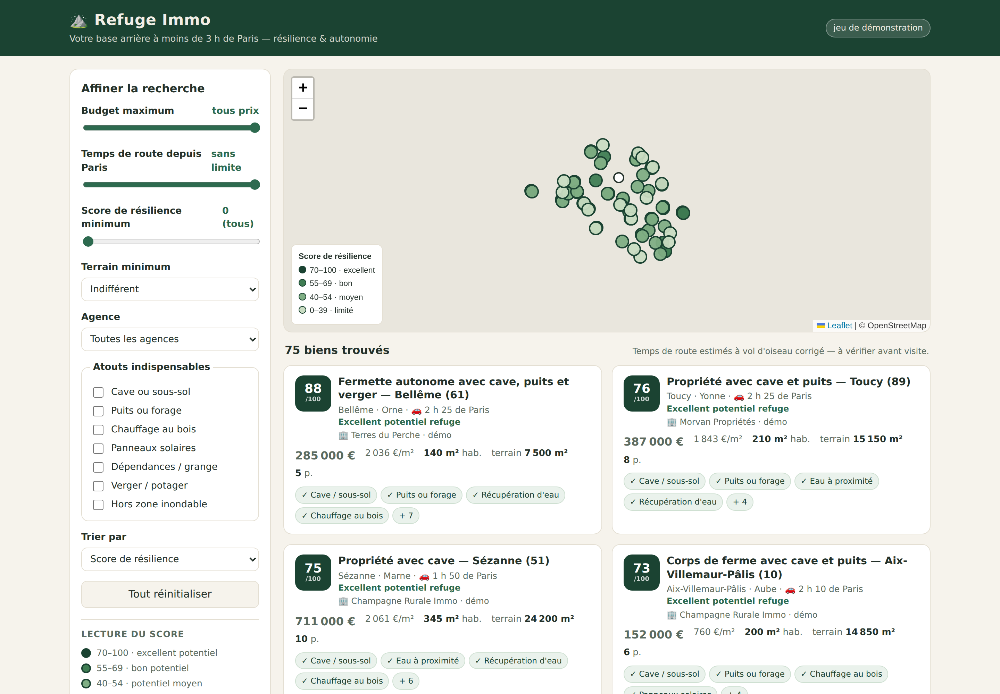
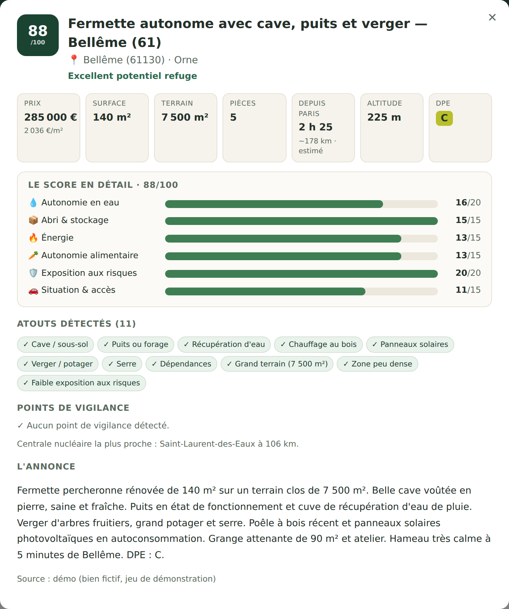

# ⛰️ Refuge Immo

**Trouvez votre base arrière à moins de 3 h de Paris.**
Refuge Immo est un POC (démonstrateur) de recherche immobilière pensé pour les
Parisiens et Franciliens qui veulent anticiper les dérèglements climatiques :
chaque bien reçoit un **score de résilience sur 100** (eau, abri, énergie,
autonomie alimentaire, risques naturels, accessibilité) et se filtre par
budget, temps de route depuis Paris, taille de terrain, présence d'une cave,
d'un puits…

---

## 🚀 Démarrer (aucune compétence technique requise)

**Étape 1 — une seule fois :** installez Python 3 depuis
[python.org/downloads](https://www.python.org/downloads/)
(sur Windows, cochez bien la case *« Add Python to PATH »*).

**Étape 2 :**

| Vous êtes sur… | Faites ceci |
|---|---|
| **Windows** | double-cliquez sur `demarrer.bat` |
| **Mac / Linux** | ouvrez un terminal dans le dossier et tapez `bash demarrer.sh` |

La première fois, l'installation prend une à deux minutes. Quand le message
« Refuge Immo démarre » apparaît, ouvrez **http://localhost:8000** dans votre
navigateur. C'est tout : l'application se charge avec 75 biens de
démonstration.

---

## 🧭 Ce que fait l'application

- **Carte + liste** des biens, avec une pastille de score colorée
  (vert foncé = excellent potentiel refuge) ;
- **Filtres** : budget, temps de route depuis Paris (estimé), score minimum,
  taille de terrain, et atouts indispensables (cave, puits, chauffage au bois,
  panneaux solaires, dépendances, potager, hors zone inondable) ;
- **Fiche détaillée** : décomposition du score en 6 piliers, atouts détectés,
  points de vigilance (zone inondable, sols argileux, centrale nucléaire ou
  site Seveso proche, passoire thermique…), texte de l'annonce ;
- **Détection automatique** : la cave, le puits, le poêle à bois ou le verger
  sont repérés directement dans le texte des annonces.

Le barème complet du score est expliqué dans **[docs/CRITERES.md](docs/CRITERES.md)**.

---

## 📦 D'où viennent les annonces ?

| Source | État |
|---|---|
| **Jeu de démonstration** (75 biens fictifs mais réalistes, communes et prix plausibles) | ✅ chargé automatiquement |
| **Bien'ici** (API JSON du site — position GPS et DPE inclus) | ⚙️ `bash scripts/collecter.sh bienici` — usage personnel, voir `scraper/README.md` |
| **Robots de collecte** (sites d'annonces entre particuliers : PAP, immo-entre-particuliers) | ⚙️ fournis, à lancer soi-même : `bash scripts/collecter.sh pap` |
| **Risques officiels Géorisques** (État) | ⚙️ `python scripts/enrichir_risques.py` (nécessite internet) |
| SeLoger, Leboncoin… | ❌ volontairement absents du POC |

Pourquoi pas les grands portails ? Leurs conditions d'utilisation
**interdisent la collecte automatisée** et ils la bloquent techniquement.
Les détails et les alternatives propres (flux partenaires, agrégateurs sous
licence) sont dans **[docs/LEGAL.md](docs/LEGAL.md)** — à lire avant toute
collecte réelle. Les robots fournis respectent d'office le fichier
`robots.txt` des sites et une cadence lente.

---

## ⚠️ Limites connues du POC

- Les **temps de route sont estimés** (distance à vol d'oiseau corrigée) :
  comptez ±20 minutes, vérifiez avant une visite ;
- les biens de démonstration sont **fictifs** (le bandeau en haut à droite le
  rappelle) ;
- les risques du jeu de démonstration sont plausibles mais simplifiés ; la
  vraie donnée s'obtient via le script Géorisques ;
- les robots de collecte dépendent de la mise en page des sites : voir
  `scraper/README.md` si l'un d'eux ne trouve plus rien.

---

## 🗂 Structure du projet

| Dossier / fichier | Rôle |
|---|---|
| `demarrer.sh` / `demarrer.bat` | démarrage en un clic |
| `app/` | serveur web, base de données, **moteur de score** (`scoring.py`) |
| `app/static/` | l'interface (carte, filtres, fiches) |
| `scraper/` | robots de collecte Scrapy + garde-fous |
| `scripts/` | jeu de démo, collecte, enrichissement Géorisques |
| `data/annonces_demo.json` | les 75 biens de démonstration |
| `docs/` | barème du score, cadre légal, captures |
| `tests/` | 14 tests automatiques (`python -m pytest tests/`) |

---

## 🔭 Pistes pour la suite

1. brancher un vrai calculateur d'itinéraires (temps de route exacts) ;
2. alertes e-mail quand un bien dépasse un score donné ;
3. données climat 2050 (sécheresse, canicules — projections DRIAS) par commune ;
4. prix du marché local via les ventes réelles (données DVF open data) ;
5. partenariats / flux officiels pour élargir les sources d'annonces.
